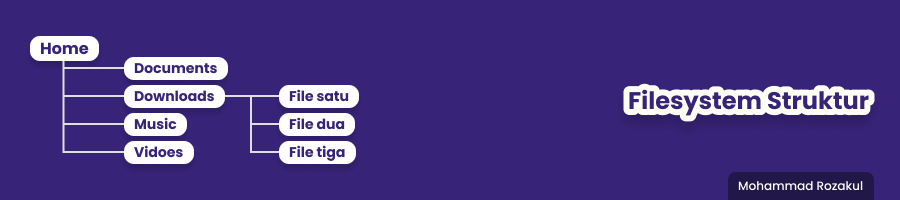

# **Unix Command Line**
## CLI (Command Line Interface)

### Apa itu Shell ?

> **Shell** adalah sebuah antarmuka pengguna yang digunakan untuk menjalankan program, mengelola file, serta berinteraksi dengan komputer. 
> CLI adalah jenis shell berbasis teks. berbeda pada umumnya yang kita gunakan sehari-hari adalah GUI (Graphic User Interface) antarmuka yang kaya akan warna, gambar, dan clikable. CLI diakses lewat terminal.

### Kenapa harus menggunakan CLI ?
> Pemrosesan dengan CLI jauh lebih cepat di bandingkan dengan GUI

### Apa itu Filesystem Struktur ?
> kita sudah bisa tau dari namanya, ya benar. Filesystem Struktur adalah cara sistem untuk menstrukturisasi file dalam bentuk hirarki atau pohon tree
> 

### Macam-macam CLI :
> - bash
> - sh
> - zsh
> - cmd.exe

### Berikut adalah command/syntax pada CLI
1. Navigation
   >   - **pwd** untuk melihat posisi direktori saat ini
   >   - **cd** untuk berpindah direktori
   >   - **ls** untuk menampilkan seluruh file pada suatu direktori
   >   - **ls -a** untuk menampilkan seluruh file pada suatu direktori beserta file hidden
   
2. Manipulation
   > - **mkdir** untuk membuat direktori/folder baru
   > - **touch** untuk membuat file baru
   > - **nano** untuk membuka file
   > - **head** untuk melihat isi file (10 baris dari atas)
   > - **tail** untuk melihat isi file (10 baris dari bawah)
   > - **cat** untuk melihat seluruh isi file secara lengkap
   > - **cp** untuk menyalin file
   > - **mv** untuk memindahkan file dan bisa juga mengganti nama file 
   > - **mv -r** untuk memindahkan direktori/folder
   > - **rm** untuk menghapus file
   > - **rm -r** untuk menghapus direktori/folder

