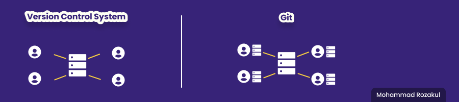

# **Git & Github Dasar**
## Git 

### Apa itu Git ?
> Git adalah salah satu sistem pengontrol versi **(Version Control System)** pada proyek perangkat lunak yang diciptakan oleh Linus Torvalds

### Apa itu VCS (Version Control System) ?
> Sebuah kumpulan perangkat lunak yang sudah terintegrasi dan digunakan untuk membantu software engineer mengelola perubahan dalam source code dari waktu ke waktu. 

### Kenapa harus menggunakan Git ?
> Git dikenal juga dengan distributed revision control (VCS terdistribusi), artinya penyimpanan database Git tidak hanya berada dalam satu tempat saja.
> 
> 
> 
> Semua orang yang terlibat dalam pengkodean proyek akan menyimpan database Git, sehingga akan memudahkan dalam mengelola proyek baik online maupun offline.
> 
> Penggunaan git sangat penting terutama bagi **Software Developer**. menggunakan git direktori kita akan lebih clean atau bersih, tidak banyak file yang berisi hampir sama ketika melakukan perubahan, kita juga bisa melacak setiap perubahan yang telah dilakukan, tidak hanya itu git juga memudahkan kita bekerja bersama tim.

### Berikut adalah macam-macam vendor Git :
> - Github
> - Gitlab
> - Bitbucket

#### ----------------- Download git  **[Disini](https://git-scm.com/download/win)**. ------------------

## Github
### Apa itu Github ?
> Github adalah website/platform online yang bisa kita gunakan sebagai tempat menyimpan direktori atau bahasa kerennya adalah repository. dengan github kita bisa mengelola repositori kita dengan git secara online dan memungkinkan kita berkolaborasi dengan orang lain

### Bagimana alur kerja Git dan Github ?
> 1. buat direktori
> 2. inisialisasi git pada direktori kita
> 3. buat akun di Github
> 4. hubungkan git lokal kita dengan github
> 5. masukan perubahan ke stagging area
> 6. save perubahan secara permanen dengan commit
> 7. kirim perubahan yang di lokal tadi ke github

## Berikut adalah Command/syntax pada Git :
1. Setup 
   > - **git config global user.name 'zaq'** untuk mengkonfigurasi username pengguna
   > - **git config global user.email 'arraza08@gmail.com'** untuk mengkonfigurasi email pengguna
   > - **git init** untuk menginisialisasi direktori

2. Manipulation
   > - **git status** untuk apakah terjadi perubahan pada git atau tidak
   > - **git add .** untuk menambahkan/memasukan perubahan yang ada pada semua pada semua file ke stagging area atau penyimpanan sementara
   > - **git commit -m 'pesan commit'** untuk menyimpan perubahan ke penyimpanan permanen dan mendeskirpsikan perubahan apa yang telah terjadi
   > - **git logs** untuk melihat/melacak perubahan apa saja yang sudah dilakukan
   > - **git logs --oneline** untuk melihat/melacak perubahan apa saja yang sudah dilakukan dalam satu baris saja
   > - **git push -u origin** untuk mengirimkan perubahan yang terjadi ke remote repositori(online)
   >- **git pull** untuk menerima/mengambil perubahan yang terjdi dari remote repositori(online)
   >- **git branch -M 'nama branch'** untuk membuat branch/jalur baru
   >- **git checkout** untuk berpindah antar commit
   >- **git reset** untuk berpindah sekaligus menghapus commit terbaru
   >- **git remote** untuk menghubungkan direkotri dengan repositori(online)
   >- **git clone** untuk mengkloning repositori

