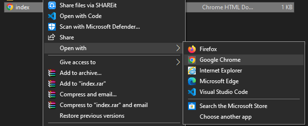
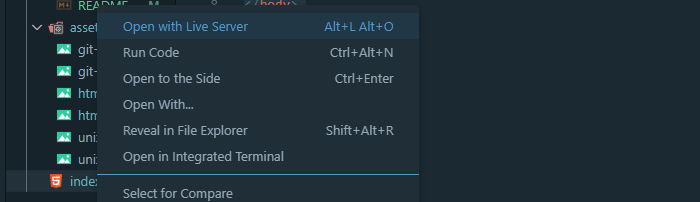
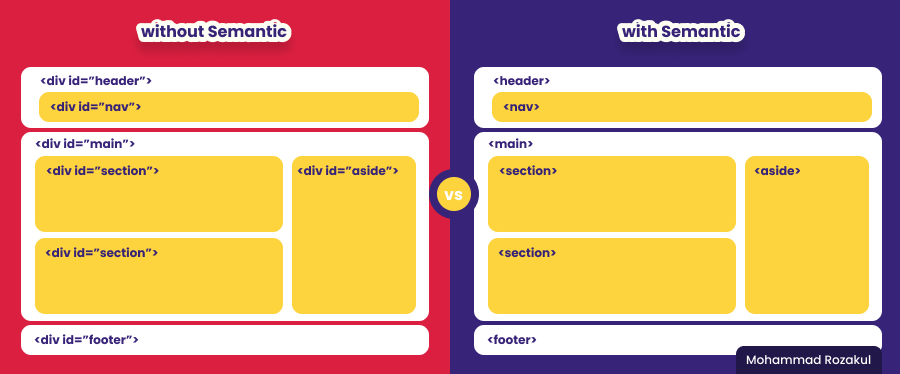

# **HTML**
### Apa itu HTML ?
> Html (Hypertext Markup Language) adalah bahasa markup untuk menampilkan konten pada halaman web browser.

### Membuat Hmtl butuh Tools apa ?
> Tidak perlu tools macam-macam dalam membuat html, cukup browser dan notepad saja sebenarnya sudah bisa, namun lebih baik lagi menggunakan code editor

### Contoh Html sederhana
```
<!DOCTYPE html>
<head>
    <title>Document</title>
</head>

<body>
    <p>Halo Dunia</p>
</body>

</html>
```

### Bagaimana cara menjalankan Html ?
1. Manual
   > 
   > 
   > - Klik 2x pada file html
   > - Klik kanan pada file html > open with > browser kesayangan kita

2. Live Server (Visual Studio Code)
   > 
   > 
   > - Klik kanan pada file html > Open With live Server 

### Berikut adalah tag-tag html :
1. Struktur wajib
   >- `<html>...</html>` untuk memberi tau browser bahwa ini adalah file html
   >- `<head>...</head>` sebagai tempat untuk menambahkan meta data pada laman html
   >- `<title>...</title>` untuk memberikan judul pada laman web
   >- `<body>...</body>` untuk menuliskan semua konten yang akan ditampilkan di laman browser
2. Konten
    >- `<h1>,<h2>,<h3>,<h4>,<h5>,<h6>` untuk membuat heading/judul utama
    >- `<table>...</html>` untuk membuat table
    >- `<p></p>` untuk membuat paragraf
    >- `<b>...</b>` untuk menebalkan teks
    >- `<!Doctype>` untuk auto update html kita ke html versi paling terbaru
    >- `<style>...</style>` untuk menempatkan syntaks css secara internal
    >- `<ul>` untuk membuat list tidak terurut
    >- `<ol>` untuk membuat list terurut
    >- `` untuk menambahkan gambar 
    >- `<a>` untuk membuat link
    >- `<i>` untuk membuat teks menjadi miring
    >- `<video>` untuk menambahkan video
    >- `<div>` untuk mengelompokkan atau membuat bagian 
    > 
    >- `<form>` untuk membuat formulir
3. contoh sederhana membuat table biodata diri 
    >```
    >        <!DOCTYPE html>
    >
    >        <head>
    >            <title>Bioadata</title>
    >        </head>
    >
    >        <body>
    >            <h1>Biodata diri :</h1>
    >            <table>
    >                <tr>
    >                    <td>Nama</td>
    >                    <td>Mohammad Rozakul M</td>
    >                </tr>
    >                <tr>
    >                    <td>Kelompok</td>
    >                    <td>FEBE31</td>
    >                </tr>
    >                <tr>
    >                    <td>Track</td>
    >                    <td>Front-End WEB Developer</td>
    >                </tr>
    >            </table>
    >        </body>
    >
    >        </html>
    >```

### Apa itu Semantic Html ?
> Adalah tag-tag html5 yang sudah mendekati bahasa manusia(inggris) atau lebih ramah untuk manusia dan komputer itu sendiri dalam mengenali struktur html. dengan semantic struktur html kita akan terlihat lebih clean dan tidak amibgu

### Html VS Semantic Html
> 

1. implementasi struktur non semantic
``` <!DOCTYPE html>

<head>
    <title>Non Semantic</title>
</head>

<body>
    <div id="header">
        <div id="nav"></div>
    </div>
    <div id="main">
        <div id="section"></div>
        <div id="section"></div>
        <div id="aside"></div>
    </div>
    <div id="footer"></div>
</body>

</html>
```
2. implementasi struktur html semantic

``` <!DOCTYPE html>

<head>
    <title>Semantic</title>
</head>

<body>
    <header>
        <nav></nav>
    </header>

    <main>
        <section></section>
        <section></section>
        <aside></aside>
    </main>

    <footer></footer>
</body>

</html>
```


