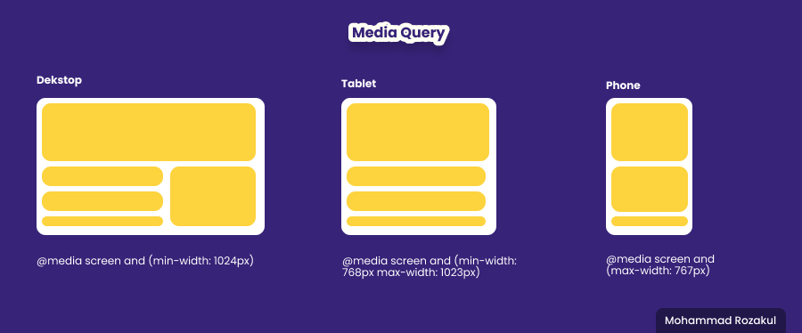
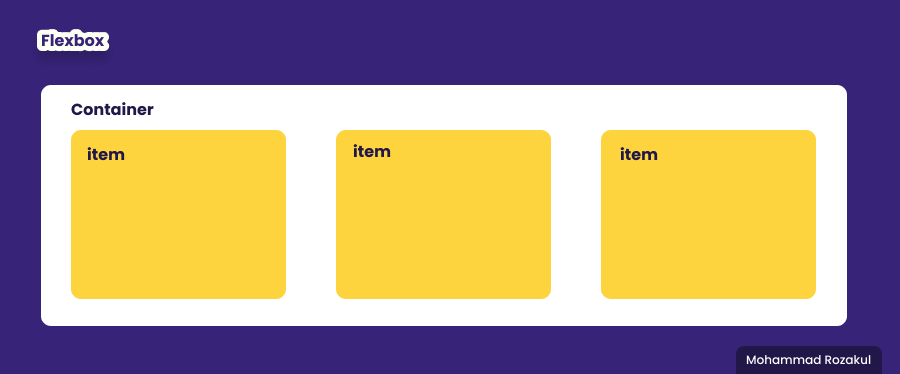

# **CSS**
### Apa itu CSS ?
> CSS (Casecading Style Sheet) yang berfungsi untuk menghias tampilan layout halaman web lebih indah dan sedap di pandang mata.

### Bagaimana cara menghubungkan CSS ?
1. Inline CSS
```
<p style="color: red"> Skilvul.com </p> 
```
2. Internal CSS
```
<!DOCTYPE html>
<head>
    <title>Internal CSS</title>
    <style>
        p {
            color: red;
        }
    </style>
</head>

<body>
    <p>Skilvul.com</p>
</body>

</html>
```
3. Eksternal CSS
```
<!DOCTYPE html>
<head>
    <title>Internal CSS</title>
    <link rel="stylesheet" href="style.css">
</head>

<body>
    <p>Skilvul.com</p>
</body>

</html>
```

### Beberapa Syntax Styling CSS :
> - color
> - background-color
> - width
> - height
> - display
> - position
> - padding 
> - margin

### Bagaimana Cara Styling CSS ?
Sturuktur Dasar Syntax CSS
```
Selector {
    Property : Value;
}
```
```
p {
    color : red;
}
```

### Contoh penerapan styling css pada file html
Tulisan **Skilvul** akan berwarna merah, menggunakan internal css
```
<!DOCTYPE html>
<head>
    <title>Internal CSS</title>
    <style>
        p {
            color: red;
        }
    </style>
</head>

<body>
    <p>Skilvul.com</p>
</body>

</html>
```

### Apa itu Responsif Web Design ?
> Responsive web design atau desain web responsif adalah sebuah teknik atau metode bagi web designer untuk membuat suatu layout website yang dapat menyesuaikan diri sesuai dengan ukuran layar pengguna.
>
>Baik dari ukuran huruf, user interface, gambar dan tata letak akan menyesuaikan dengan lebar layar dan resolusi device yang digunakan. 
> 

### Apa itu Flexbox ?
Flexbox adalah suatu cara untuk mengatur layout atau tata letak agar bisa terlihat responsif
> 

### Flexbox syntax :
> - Flex direction untuk mengatur letak child
> - Flex wrap mengatur tata letak child pada 1 line
> - Flex flow yaitu sebagai shortcut untuk set up flex-direction dan flex-wrap secara bersamaan
Order untuk ordering item yang ingin diatur posisinya
> - Justify - content untuk mengatur tata letak antar item child secara horizontal
> - Align - content untuk mengatur tata letak antar item child secara vertikal atau cross axis
> - Flex-grow untuk mengatur size suatu item child pada flexbox
> - Flex-shrink untuk memperkecil size suatu item child secara relatif terhadap item child lainnya
> - flex-basis untuk mengatur width setiap item child

