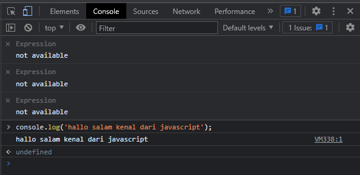

# **Javascript**

### Apa dan Bagaimana peran javascript pada WEB ?
> Javascript adalah bahasa pemrograman yang sangat powerfull untuk membuat website menjadi lebih interaktif dan dinamis

### Bagaimana cara menjalankan Javascript ?
> Javascript pada umumnya sudah tertanam pada setiap browser, kita bisa menjalakannya dengan membuat file berformat .js dan yang dihubungkan dengan file html atau bisa langsung mencobanya di console
> 

### Berikut Tipe data dalam Javascirpt :
> - **number** adalah tipe data yang mengandunng semua angka termasuk desimal
>- **string** adalah tipe data yang kumpulan karakter dan harus di apit oleh kedua kutip ''
>- **boolean** adalah tipe data yang hanya memliki 2 data yaitu true dan false
>- **null** adalah tipe data yang tidak bernilai namun bukan berarti kosong
>- **undifined** adalah tipe data yang belum di definisikan
>- **object** adalah tipe data yang memiliki nilai yang saling berhubungan
>- **array** adalah tipe data yang menyimpan lebih dari satu tipe data
