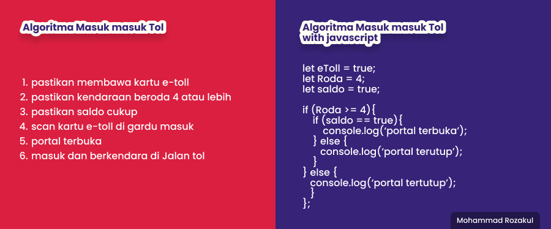

# **Algoritma**
### Apa itu Algoritma ?
> Algoritma adalah sebuah alur atau tahap-tahapan untuk menyelesaikan sesuatu pekerjaan atau memecahkan suatu masalah

### Apa itu Struktur Data ?
> Struktur data adalah cara menyimpan dan mengatur data secara terstruktur pada sistem komputer atau database sehingga lebih mudah diakses. 

### Keuntungan menggunakan Algoritma dan Struktur data yang tepat 
> dengan algoritma yang tepat di tambaha lagi dengan pemilihan sturuktur data yg tepat akan membuat proses atau tahapan-tahapan dalam menyelesaikan suatu pekerjaan jauh lebih efisien dan tepat sasaran

### Contoh Algoritma masuk jalan Tol
> 

### Contoh Struktur data Array pada js
mengelompokkan buah berdasarkan abjad
```
let buah = ["Jeruk", "Apel", "Mangga", "Jambu"];
buah.sort();

console.log(buah); // Output: ["Apel", "Jambu", "Jeruk", "Mangga"]
```