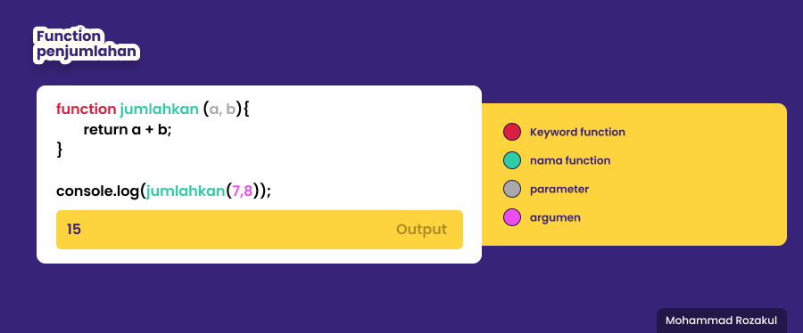

# **Javascript**

## Perulangan/Looping

### Apa itu perulangan ?
> perluangan adalah suatu bentuk kegiatan mengulang suatu statement sampai batas yang diinginkan.


### Ada berapa Jenis perulangan pada javascript ?
>1. for
>> cetak string 'ayo belajar' sebanyak 10 kali
>>```
>> for(let i = 1; i <= 10; i++){
>>    console.log('ayo belajar' )
>>  };
>>```
>> cetak angka 1 s/d 10 dan temukan angka 7
>>```
>> for(let i = 1; i <= 10; i++){
>>    if (i == 7){
>>        console.log(i + ' nah ini ketemu nih);
>>    } else {
>>        console.log(i);
>>    };
>>};
>>```
>- while
>>  nyalakan mesin jika bensin > 0, bensin akan terus berkurang dan berhenti ketika bensin = 0 atau habis;
>> ```
>> while(bensin > 0){
>>    console.log("Masih ada bensin, nyalakan mesin!");
>>   bensin--;
>>};
>- do while
>>```
>> do{
>>    console.log("Nyalakan mesin!");
>>    bensin--;
>> } while(bensin > 0)

## Javascript Scope
### Apa itu scope ?
> scope adalah konsep data variabel atau bisa di bilang 'jangkauan', menentukan sebuah variabel bisa di akses pada scope tertentu atau tidak.

### Apa itu blocks ?
> block adalah code yang berada di dalam '{}', terdapat pada function, condition, looping

### Global scope vs Local scope
>- **Global scope**
>   - tempat yang membuat variabel kita bisa di akses dimana pun pada seluruh isi file, kita harus menempatkan variabel kita diluar blocks
>- **local scope**
>   - tempat yang membuat kita hanya bisa di akses di dalam blocks saja, variabel kita letakan di dalam bloks code.

> 

## Function
### Apa itu function ?
> function adalah sebuah block code yang dibuat untuk menyelesaikan 1 task/1 fitur. yang bisa kita gunakan berkali-kali hanya dengan manggilnya.

### Bagiamana cara mebuat function ?
> ```
> keywordFunction nameFunction (parameter){
>    isi function
>};


## Eror
### Apa itu eror ?
> eror adalah kesalahan yang terjadi karena sengaja  atau tidak sengaja yang dilakukan oleh kita sebagai developer

### Bagaimana mengatasi eror ?
> harus tetap tenang dan jangan panik, baca dengan detail pesan eror yang muncul kemudian perbaiki eror yang terjadi bisa dengan membuka dokumentasi agar lebih mudah memahami eror

### Eror yang sering muncul :
> 
> eror karena variabel yang kita buat sebelumnya adalah const dan kita tak bisa mengubahnya

> 
> eror terjadi karena variabel/data 'nama' belum di definisikan

>
> eror terjadi karena kesalahan syntax