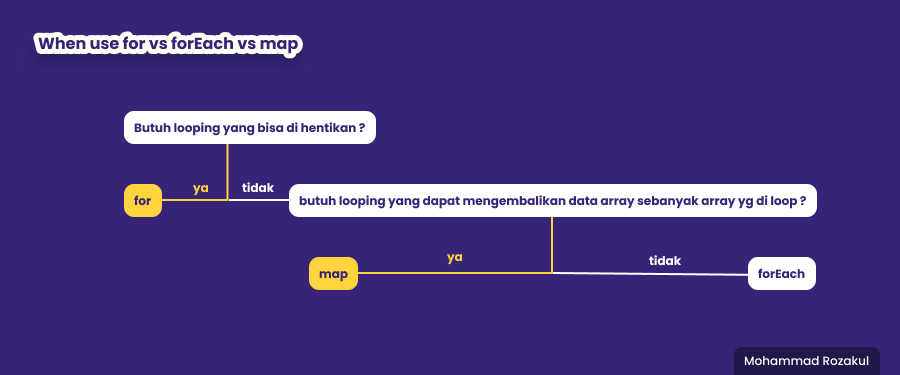
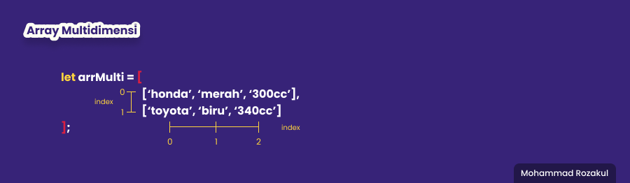

# **Javascript Intermediate**
## Array JS

### Apa itu array ?
> Array adalah sebuah variable yang menampung banyak nilai sekaligus dengan typedata yang berbeda2

### Bagaimana cara mendeklarasikan Array ?
>``` 
> let arrayName = [1, 'satu', true, 1.45]
> ```

### Playing With Array 
> - arrayName[index] = mengakses data array
> - arrayName.push() = memasukan/menambah data array di paling belakang
> - arrayName.pop() = mengeluarkan/menghapus data array di paling belakang
> - arrayName.unshift() = memasukan/menambah data array di paling depan
> - arrayName.shift() = mengeluarkan/menghapus data array di paling didepan
> - arrayName.length = untuk menghitung jumlah index array
> - arrayName.splice(start index, deleteCount, add index) = merubah data array dari tengah/custom
>    ``` 
>    let namaBuah = ['jeruk', 'mangga', 'apel', 'durian'];
>    namaBuah.splice(1,2,'pisang');
>    
>   console.log(namaBuah)
>   // output : ['jeruk', 'mangga', 'pisang' ]
>   ```
> - arrayName.slice(start,stop) = mengcopy data array
>    ``` 
>    let namaBuah = ['jeruk', 'mangga', 'apel', 'durian'];
> 
>    let namaBuahBaru = namaBuah.slice(1,3)
>    
>    console.log(namaBuahBaru);
>    // output : ['mangga', 'apel']
>    ```


### Perulangan with Array
Tampilkan seluruh isi array
```  
const city = ['kyoto', 'yokohama', 'tokyo', 'osaka'];

for (let i = 0; i < city.length; i++){
    console.log(i)
}

for (let i of city){
    console.log(i)
}


-----------------------------------
// output :
------------------------------------
kyoto
yokohama
tokyo
osaka
kyoto
yokohama
tokyo
osaka

```

Tampilkan seluruh isi array dari belakang
```
const city = ['kyoto', 'yokohama', 'tokyo', 'osaka'];

for (let i = city.length; i < -1; i--){
    console.log(i)
}


-----------------------------------
// output :
------------------------------------
osaka
tokyo
yokohama
kyoto
```

## Perulangan forEach
> - arrayName.forEach((function) => {})
> - arrayName.forEach(function() {})

> ```
> const city = ['kyoto', 'yokohama', 'tokyo', 'osaka'];
> 
> city.forEach((item) => {
>    console.log
> })
>
> 
> 
> -----------------------------------
> // output :
> ------------------------------------
> osaka
> tokyo
> yokohama
> kyoto
> ```

## Perulangan map()
> - arrayName.map((function) => {})
> - arrayName.map(function() {})
> ```
> const city = ['kyoto', 'yokohama', 'tokyo', 'osaka'];
> 
> let cityKeren = city.map((item) => {
>    return item + ' keren'
> })
>
> 
> console.log(cityKeren)
> 
> -----------------------------------
> // output :
> ------------------------------------
> osaka keren
> tokyo keren
> yokohama keren
> kyoto keren
> ```

### Apa perbedaan forEach vs map
> foreach
> - tidak mampu return

> map
> - mampu return
> - akan selalu mengembalikan data sesuai dengan index yg ada dalam array

### Kapan harus menggunakan for vs forEach vs map ?
> 

## Array Multidimensi
> ```
> let arrayName = [
>                    [data1, data2, data3],
>                    [tada1, tada2, tada3]
>                ];
> ```
> 
> ```
> console.log(arrMulti[0][1])
> console.log(arrMulti[1}[2])
>
>
> ------------------------------
> // output :
> ------------------------------
> merah
> 340cc

## Object JS
### Apa itu object ?
> pada dunia nyata kita sering sekali berjumpa dengan object, entah benda hidup atau benda mati. seperti : mobil, keyboard, laptop, 
>
> namun dalam dunia programming object adalah sebuah type data pada variabel yang menyimpan properti dan fungsi(method).

### Bagaimana cara deklarasi object ?
> ```
> let nameObject = {
>    properti1: value1,
>    properti2: value2,
>    properti3: value3
> };
> ```

### Akses object
```
let mobil = {
    merk: 'toyota',
    mesin: 'depan',
    warna: 'merah'
    warna velg: 'emas'
};

console.log(mobil)
console.log(mobil.merk)
console.log(mobil['warna velg'])


------------------------
//output :
------------------------
{merk: 'toyota', mesin: 'depan', warna: 'merah'}
toyota
emas
```
> dapat menggunakan dot notation "." atau bracket "[]"
, gunakan bracket "[]" jika properti mengandung spasi

### Manipulating Object
```
let buku ={
    judul: 'Darkside Programmer',
    penulis: 'zaq',
    halaman: 254,
}

console.log(buku)
```
```
// output :
-------------------------------------
{judul: 'Darkside Programmer', penulis: 'zaq', halaman: 254,}
```

- Menambahkan properti baru  
``` buku.tahun = 2029 ```  
``` buku['edaran'] = 'vol 13'```
```
// output :
-------------------------------------
{judul: 'Darkside Programmer', penulis: 'zaq', halaman: 254, tahun: 2029, edaran: 'vol 13'}
```
- Mengganti isi properti  
``` buku.halaman = 255 ```  
``` buku['edaran'] = 'vol 14'```
```
// output :
-------------------------------------
{judul: 'Darkside Programmer', penulis: 'zaq', halaman: 255, tahun: 2029, edaran: 'vol 14'}
```
- Menghapus properti  
```delete buku.tahun```  
```delete buku['edaran'] ```
```
// output :
-------------------------------------
{judul: 'Darkside Programmer', penulis: 'zaq', halaman: 254}
```