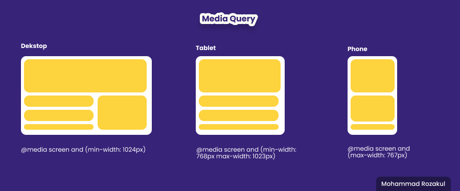

# **Javascript Intermediate**
## Asyncrhonous 
- Asynchronous Fetch
   ```
     fetch("https://pokeapi.co/api/v2/pokemon/pikachu/", {
  method: "GET"
  })
   .then(async (response) => {
  let convertData = await response.json();
  console.log(convertData);
  })
  .catch((error) => {
  console.log(error);
  });
   ```
- Asynchronous promise
   ```
      function GetUser(id) {
      return new Promise((resolve, reject) => {
      if (id !== "" && id !== undefined) {
      resolve (id);
      } else {
      reject ("ID Harus di Isi");
      }
      });
   }
   
   GetUser( ) // memanggil fungsinya GetUser
   .then((response) => {
      console.log(response);
      })
   .catch((error) => {
   console.log(error);
   });
   ```
---
## Git & Github lanjutan
1. membuat branch baru  
   ```git branch branchName```

2. pindah branch   
   ```git switch brancName```
   or  
   ```git checkout brancName```
3. menggabungkan isi branch  
   ```git merge brancName```
   
----

## Responsive WEB Design 
### Apa itu responsive WEB Design ?
> adalah design yang tetap terlihat bagus menyesuaikan ukuran layar pengguna

### Beberapa cara setting Design WEB menjadi responsive
1. Add viewport in html
   ```
   <meta name="viewport" content="width=device-width, initial-scale=1.0">
   ```
2. Use max width
    ```
    
    ```
3. Use element responsive with css
   > - %
   > - rem
   > - em
   > - vh
   > - media query
   > 

4. Use media query



----

# **Bootstrap**
### Apa itu bootstrap ?
> bootstrap adalah sebuah framework css yang memudahkan kita untuk styling menjadi lebih mudah, rapih, cepat dan responsive

### Cara memasang bootstrap
1. online
   > buat meta tag di head. Cara memanggil css bootstrap dengan menggunakan href lalu mengganti link href css lokal dengan link boostrap online.

2. offline
   > download dan ekstrak bootstrap, lalu satukan dalam satu folder html. hubungkan file :
   > - bootstrap.min.css
   > - bootstrap.min.js
   

### Breakpoints pada bootstrap :
- sm
- md
- lg
- xl
- xxl

### Cara penggunaan bootstrap
> caranya sangat mudah, hanya dengan memberi class pada element html yang ingin kita styling, penamaan class pun sangat relevan 
>
>  ```
>   <p class='text-danger'>Skilvul.com</p>
> ```

