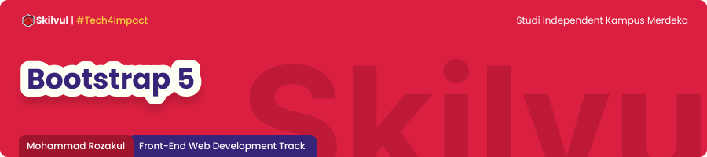

# **Javascript Intermediate**
## Asyncrhonous Fetch

## Responsive WEB Design 
### Apa itu responsive WEB Design ?
> adalah design yang tetap terlihat bagus menyesuaikan ukuran layar pengguna

### beberapa cara setting Design WEB menjadi responsive
1. Add viewport in html
   ```
   <meta name="viewport" content="width=device-width, initial-scale=1.0">
   ```
2. Use max width
    ```
    
    ```
3. Use element responsive with css
   > - %
   > - rem
   > - em
   > - vh
   > - media query
   > 

4. Use media query


----

# **Bootstrap**
### Apa itu bootsrap ?
> bootstrap adalah sebuah framework css yang memudahkan kita untuk styling menjadi lebih mudah, rapih, cepat dan responsive

